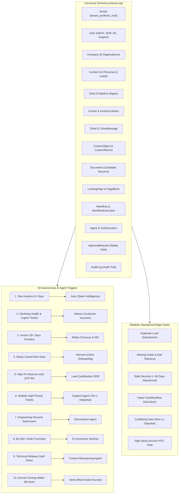

# Synthetic Test Dataset & Automation Trigger Architecture Reference

## Executive Summary
This document defines the synthetic test dataset architecture designed for the Business OS multi-tenant ecosystem. Built directly against the canonical SQL schema (`schema.sql`), the dataset populates realistic relational entities, strict foreign key constraints, 10 targeted automation trigger scenarios, and 6 realistic edge cases inside a dedicated test tenant (`tenant_synthetic_eval`).

---

## Architecture & Data Flow



---

## 10 Autonomous AI Agent Trigger Scenarios

| # | Scenario | Target Agent / Sentinel | Target Entity & Conditions | Expected Automation Behavior |
|---|---|---|---|---|
| **1** | **Deal inactive 8+ days** | **Ares** (Sales Intelligence) | `Deal` (`deal_ares_stalled`, amount: $85,000, stage: `Proposal`, `updatedAt`: 11 days ago) | Detects inactivity period >= 8 days, drafts tailored consultative recovery playbook, and advances pipeline. |
| **2** | **High-risk customer / declining health** | **Athena** (Customer Success) | `Company` (`cmp_apex_global`, health score: 42) + `Ticket` (2 open `URGENT` tickets) + `Invoice` (`OVERDUE`) | Flags critical churn risk (score < 50), initiates proactive intervention plan, alerts CS lead. |
| **3** | **Invoice 30+ days overdue** | **Midas** (Treasury & AR) | `Invoice` (`inv_midas_overdue`, amount: $14,500, status: `OVERDUE`, `dueDate`: 35 days ago) + 2 line items | Classifies into 31-60 day aging bracket, generates dynamic payment link, stages dunning notice 2. |
| **4** | **Newly closed deal** | **Hermes** (Operations Sentinel) | `Deal` (`deal_hermes_won`, amount: $120,000, stage: `Won`, `updatedAt`: today) | Kicks off client onboarding project (`prj_stark_onboarding`) and dispatches provisioning tasks. |
| **5** | **New qualified lead** | **Lead Qualification SDR** | `Contact` (`cnt_david_miller`, VP of Eng, 350 employees, $150k budget, source: `website`) | Evaluates firmographics, scores ICP fit at 90 (Tier 1 Enterprise), routes to Enterprise AE. |
| **6** | **Multiple high-priority tickets** | **Support Agent** (Helpdesk) | `Ticket` (3 open tickets: 2 `URGENT`, 1 `HIGH` priority) + `TicketMessage` | Triggers immediate incident escalation, initiates knowledge base RAG diagnosis, updates on-call. |
| **7** | **New resume submission** | **Recruitment Agent** | `CustomRecord` (`job_candidate`, Elena Rostova, Staff Eng, 11 yrs exp) + `Document` (PDF resume) | Parses applicant competencies against Staff Engineer rubric, generates candidate scorecard. |
| **8** | **$1,000+ purchase** | **E-Commerce Agent** | `Invoice` (`inv_ecom_vip_purchase`, amount: $1,499.00, status: `PAID`, contact: `cnt_alice_buyer`) | Detects transaction >= $1,000 threshold, promotes contact to VIP loyalty tier, queues thank-you email. |
| **9** | **Content needing repurposing** | **Content Optimization Agent** | `LandingPage` (`lp_q3_release_notes`, `published: false`) + `PageBlock` (article body) + Whitepaper | Extracts key takeaways from long-form technical release notes, generates multi-channel social snippets. |
| **10** | **Property transaction closing deadline** | **Vesta** (Escrow Coordinator) | `CustomRecord` (`real_estate_escrow`, 742 Evergreen Terrace, $865k, `daysUntilClosing`: 2) | Radar detects closing within 48 hours, audits pending loan signoff contingencies, alerts coordinator. |

---

## Realistic Edge Cases Breakdown

1. **Duplicate Entries**:
   - Contacts `cnt_dup_lead_1` and `cnt_dup_lead_2` share identical email `lead.duplicate@target.example` submitted across different channels (`inbound_form` and `apollo_sync`).
   - Verifies deduplication and identity resolution queries.
2. **Missing Fields**:
   - `cnt_missing_fields`: Contact with null email, null phone, and null company.
   - `cmp_missing_data`: Company with null domain and industry.
   - `deal_missing_date`: Deal with $0 amount and empty expected close date.
   - Verifies system resilience against incomplete CRM ingestion.
3. **Stale Records**:
   - `deal_stale_abandoned`: Deal dormant for > 120 days at `Discovery` stage.
   - `tck_stale_closed`: Ticket resolved and closed > 110 days ago.
   - Verifies data lifecycle management, retention policies, and query exclusion filters.
4. **Failed Execution States**:
   - `texec_erp_timeout`: Tool execution marked `FAILED` after 30,042ms due to ERP timeout with full stack trace.
   - `wfexec_failed_retry`: Workflow execution marked `FAILED` with HTTP 429 rate limit error.
   - Verifies telemetry dashboards, automated retry engines, and circuit breaker policies.
5. **Conflicting Data**:
   - `deal_conflict_won_unpaid`: Deal marked `Won` for $50,000 linked to an invoice (`inv_conflict_disputed`) marked `DISPUTED`.
   - Surfaces revenue recognition mismatches for automated finance audits.
6. **High-Value Account & Human-In-The-Loop (HITL) Gate**:
   - `cmp_stark_cloud`: $120,000 contract value.
   - `appr_ares_discount`: Pending approval request with `riskLevel: 'HIGH'` for a $17,000 discount exceeding the autonomous $5,000 limit.
   - Validates that autonomous AI actions stay within designated safety boundaries.

---

## Execution & Verification Commands

To seed and verify the complete dataset at any time:

```bash
# Run automated verification suite
node scripts/seed-and-verify-automation-triggers.mjs
```

To run raw SQL seeding independently:

```bash
# Execute SQL dataset script into SQLite
python -c "import sqlite3; conn = sqlite3.connect('packages/database/prisma/dev.db'); f = open('synthetic_test_dataset.sql', 'r', encoding='utf-8'); conn.executescript(f.read()); conn.commit(); conn.close()"
```
